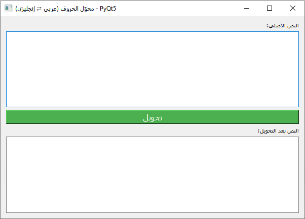
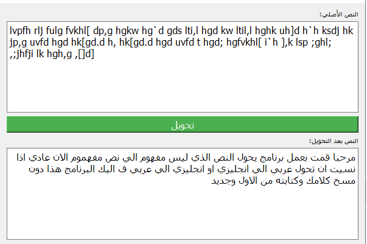
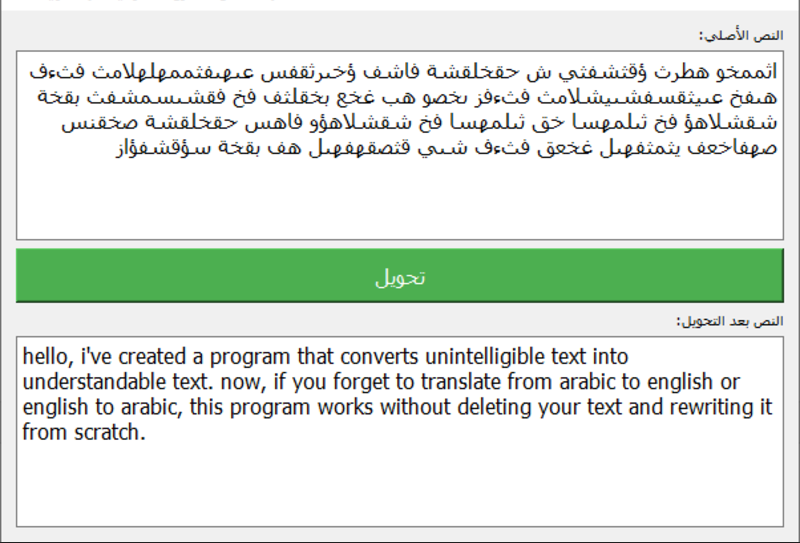

# Arabic-English Keyboard Layout Converter

A desktop application developed using **Python** and **PyQt5** that converts text between **Arabic** and **English** keyboard layouts.

The application automatically detects the input language and converts text using the corresponding keyboard layout. It also supports mixed-language input while preserving unsupported characters.

---

## Features

- ✅ Arabic → English keyboard layout conversion
- ✅ English → Arabic keyboard layout conversion
- ✅ Mixed Arabic and English text support
- ✅ Automatic language detection
- ✅ Simple and user-friendly graphical interface
- ✅ Fast and lightweight desktop application

---

## Technologies Used

- Python 3
- PyQt5

---

## Screenshots

### Main Window

The main application interface.



---

### English Keyboard Layout → Arabic

Example of converting text typed using the English keyboard layout into Arabic.



---

### Arabic Keyboard Layout → English

Example of converting Arabic text into the equivalent English keyboard layout.



---

## Installation

Clone the repository:

```bash
git clone https://github.com/YourUsername/arabic-english-keyboard-converter.git
```

Navigate to the project folder:

```bash
cd arabic-english-keyboard-converter
```

Install the required package:

```bash
pip install -r requirements.txt
```

Run the application:

```bash
python main.py
```

---

## Project Structure

```
arabic-english-keyboard-converter/
│
├── main.py
├── README.md
├── requirements.txt
├── .gitignore
├── LICENSE
└── screenshots/
    ├── app.png
    ├── app1.png
    └── app2.png
```

---

## How It Works

1. Enter or paste text into the input field.
2. Click the **Convert** button.
3. The application automatically detects the keyboard layout.
4. The converted text is displayed instantly in the output field.

---

## Future Improvements

- Copy converted text with one click
- Dark mode support
- Keyboard shortcuts
- Export converted text to a file
- Drag & Drop support
- Executable (.exe) release
- Custom keyboard layout support

---

## Author

**Mohamed Sayed**

Electronics and Communications Engineering Graduate

Interested in Information Technology, IT Support, Python, and Automation.

GitHub:
https://github.com/mohamedsayed-dev

LinkedIn:
https://www.linkedin.com/in/mohamed-sayed-158092235

---

## License

This project is licensed under the MIT License.
